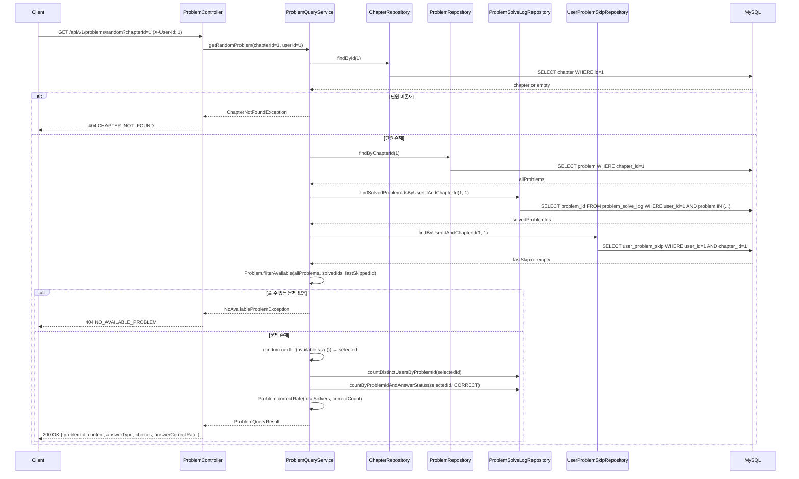
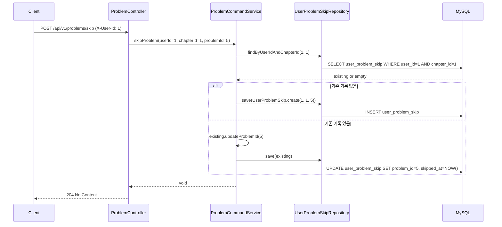
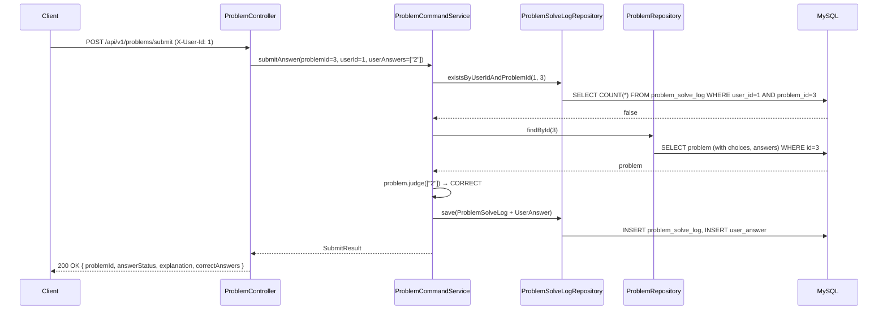
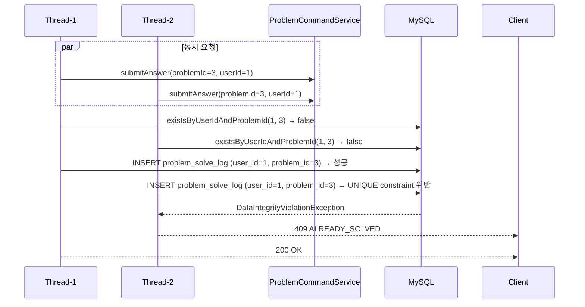
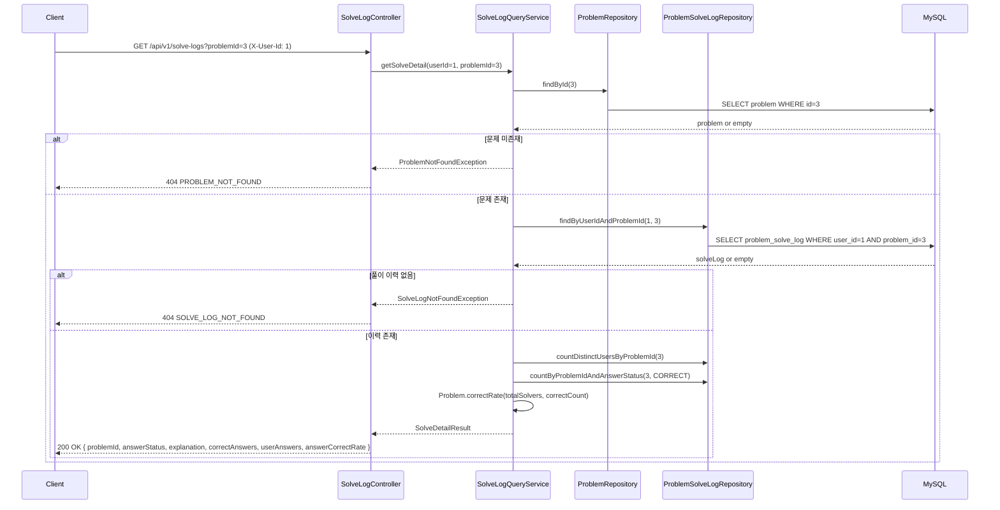

# 시퀀스 다이어그램

Solve Log Service의 주요 런타임 흐름을 시퀀스 다이어그램으로 정리한다.

---

## 목차

1. [랜덤 문제 조회](#1-랜덤-문제-조회)
2. [문제 건너뛰기](#2-문제-건너뛰기)
3. [문제 제출 (정상)](#3-문제-제출-정상)
4. [문제 제출 (동시 중복 요청)](#4-문제-제출-동시-중복-요청)
5. [풀이 상세 조회](#5-풀이-상세-조회)

---

## 1. 랜덤 문제 조회

**핵심 포인트**

- 풀이 완료 문제와 직전 건너뛰기 문제를 동시에 제외한 후 랜덤으로 선택한다.
- 정답률은 풀이 인원 30명 이상일 때만 반환하며, 미만이면 `null`이다.

---

## 2. 문제 건너뛰기

**핵심 포인트**

- 단원당 직전 건너뛰기 1건만 유지한다. 이전에 건너뛴 문제는 다음 랜덤 조회 시 다시 풀이 대상이 된다.

---

## 3. 문제 제출 (정상)

**핵심 포인트**

- 서비스 레이어에서 중복 제출 여부를 먼저 확인한 후, 문제 조회 → 채점 순으로 처리한다.
- `ProblemSolveLog`와 `UserAnswer`는 동일 트랜잭션에서 저장된다.

---

## 4. 문제 제출 (동시 중복 요청)

**핵심 포인트**

- 서비스 레이어의 `existsByUserIdAndProblemId()` 체크만으로는 동시 요청을 완전히 차단할 수 없다.
- `problem_solve_log(user_id, problem_id)` UNIQUE 제약이 최종 방어선으로 동작한다.
- `DataIntegrityViolationException`은 `GlobalExceptionHandler`에서 `409 ALREADY_SOLVED`로 변환된다.

---

## 5. 풀이 상세 조회

**핵심 포인트**

- 문제 존재 확인 → 풀이 이력 조회 순서로 처리한다.
- `userAnswers`는 사용자가 제출한 답변 목록이고, `correctAnswers`는 실제 정답 목록이다.