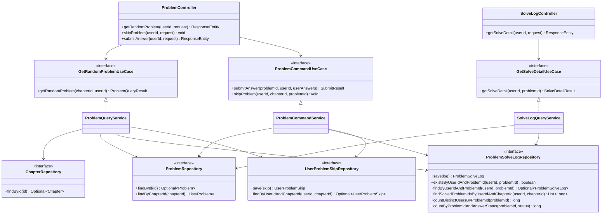
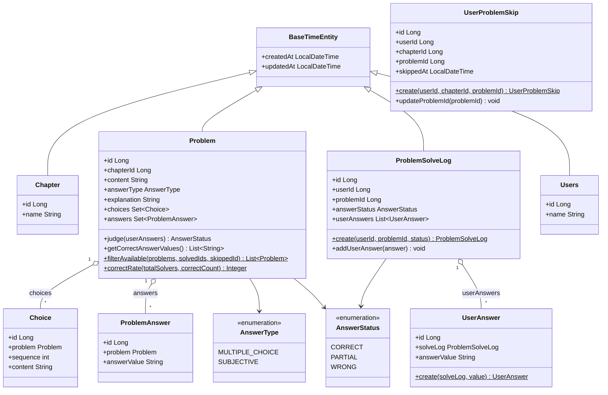
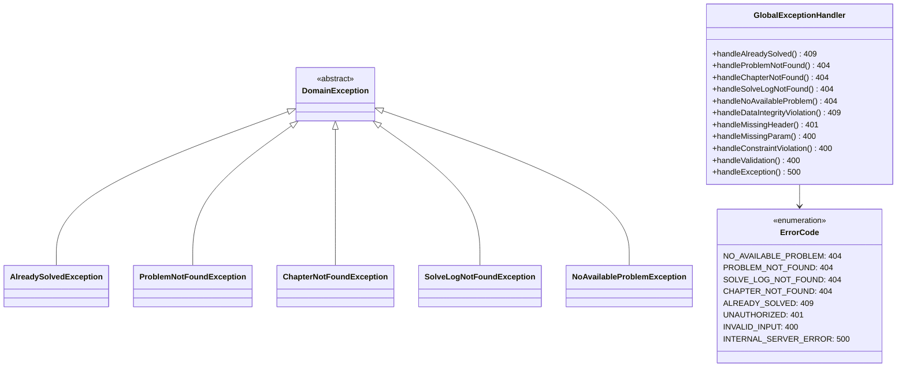

# 클래스 다이어그램

Solve Log Service의 계층 구조와 핵심 클래스 관계를 정리한다.

---

## 목차

1. [레이어드 구조 (Hexagonal)](#1-레이어드-구조-hexagonal)
2. [도메인 모델](#2-도메인-모델)
3. [예외 처리](#3-예외-처리)
4. [핵심 클래스 책임 요약](#4-핵심-클래스-책임-요약)
5. [JPA 페치 전략](#5-jpa-페치-전략)

---

## 1. 레이어드 구조 (Hexagonal)

---

## 2. 도메인 모델

---

## 3. 예외 처리

---

## 4. 핵심 클래스 책임 요약

| 클래스 | 레이어 | 주요 책임 |
|--------|--------|-----------|
| `ProblemController` | API | 문제 관련 요청 검증, DTO 변환, 응답 생성 |
| `SolveLogController` | API | 풀이 이력 조회 요청 검증, 응답 생성 |
| `LoginUserIdArgumentResolver` | API | `X-User-Id` 헤더에서 `userId` 추출 |
| `GlobalExceptionHandler` | API | 도메인/검증 예외를 HTTP 에러 응답으로 변환 |
| `ProblemQueryService` | Application | 랜덤 문제 선택, 풀이 제외 필터링, 정답률 계산 |
| `ProblemCommandService` | Application | 중복 제출 검사, 채점, 풀이 이력 저장, 건너뛰기 upsert |
| `SolveLogQueryService` | Application | 풀이 상세 조회, 정답률 계산 |
| `Problem` | Domain | 채점 로직(`judge`), 풀이 가능 문제 필터링(`filterAvailable`), 정답률 계산(`correctRate`) |
| `ProblemSolveLog` | Domain | 풀이 이력 생성, 사용자 답변 추가 |
| `UserProblemSkip` | Domain | 건너뛰기 생성, `problemId` 갱신 |
| `ChapterRepositoryImpl` | Infrastructure | `chapter` 테이블 JPA 조회 |
| `ProblemRepositoryImpl` | Infrastructure | `problem` 테이블 JPA 조회 |
| `ProblemSolveLogRepositoryImpl` | Infrastructure | `problem_solve_log` 저장, 존재 확인, 집계 쿼리 |
| `UserProblemSkipRepositoryImpl` | Infrastructure | `user_problem_skip` upsert 및 조회 |

---

## 5. JPA 페치 전략

`choices`, `answers`, `userAnswers` 컬렉션은 모두 `EAGER`로 설정되어 있으나, JPQL `LEFT JOIN FETCH` 없이 조회하면 Hibernate가 secondary SELECT를 추가 실행한다.

| 엔티티 | 메서드 | 페치 방식 | 쿼리 수 변화 |
|--------|--------|-----------|-------------|
| `Problem` | `findById`, `findByChapterId` | `LEFT JOIN FETCH` + `DISTINCT` | 3 → 1 (두 컬렉션 동시 JOIN → Cartesian product를 `DISTINCT`로 제거) |
| `ProblemSolveLog` | `findByUserIdAndProblemId` | `LEFT JOIN FETCH` | 2 → 1 (단일 컬렉션이므로 `DISTINCT` 불필요) |