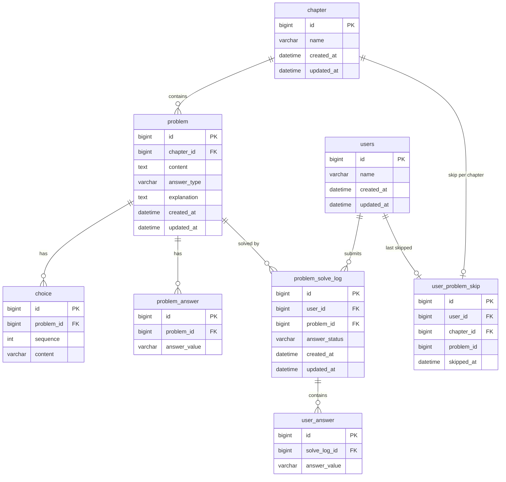

# ERD (Entity Relationship Diagram)

Solve Log Service의 테이블 구조와 관계를 정리한다.

---

## 목차

1. [전체 ERD](#1-전체-erd)
2. [테이블 상세](#2-테이블-상세)

---

## 1. 전체 ERD

---

## 2. 테이블 상세

### 2-1. chapter

| 컬럼명 | 타입 | 제약조건 | 설명 |
|--------|------|----------|------|
| id | BIGINT | PK, AUTO_INCREMENT | 단원 식별자 |
| name | VARCHAR(255) | NOT NULL | 단원명 |
| created_at | DATETIME | NOT NULL | 생성 시각 |
| updated_at | DATETIME | NOT NULL | 수정 시각 |

---

### 2-2. problem

| 컬럼명 | 타입 | 제약조건 | 설명 |
|--------|------|----------|------|
| id | BIGINT | PK, AUTO_INCREMENT | 문제 식별자 |
| chapter_id | BIGINT | FK → `chapter(id)`, NOT NULL | 소속 단원 |
| content | TEXT | NOT NULL | 문제 본문 |
| answer_type | VARCHAR(50) | NOT NULL | `MULTIPLE_CHOICE` / `SUBJECTIVE` |
| explanation | TEXT | NULL | 문제 해설 |
| created_at | DATETIME | NOT NULL | 생성 시각 |
| updated_at | DATETIME | NOT NULL | 수정 시각 |

**인덱스:** `idx_problem_chapter_id (chapter_id)` — 단원별 문제 조회

---

### 2-3. choice

| 컬럼명 | 타입 | 제약조건 | 설명 |
|--------|------|----------|------|
| id | BIGINT | PK, AUTO_INCREMENT | 선택지 식별자 |
| problem_id | BIGINT | FK → `problem(id)`, NOT NULL | 소속 문제 |
| sequence | INT | NOT NULL | 선택지 순번 (1~5) |
| content | VARCHAR(500) | NOT NULL | 선택지 내용 |

> `choice`는 `answer_type = MULTIPLE_CHOICE`인 문제에만 존재한다. `sequence` 오름차순으로 정렬된다.

---

### 2-4. problem_answer

| 컬럼명 | 타입 | 제약조건 | 설명 |
|--------|------|----------|------|
| id | BIGINT | PK, AUTO_INCREMENT | 정답 식별자 |
| problem_id | BIGINT | FK → `problem(id)`, NOT NULL | 소속 문제 |
| answer_value | VARCHAR(500) | NOT NULL | 정답 값 (객관식: sequence 번호, 주관식: 텍스트) |

> 복수 정답 문제는 `problem_answer` 행이 여러 개 존재한다.

---

### 2-5. users

| 컬럼명 | 타입 | 제약조건 | 설명 |
|--------|------|----------|------|
| id | BIGINT | PK, AUTO_INCREMENT | 사용자 식별자 |
| name | VARCHAR(255) | NOT NULL | 사용자명 |
| created_at | DATETIME | NOT NULL | 생성 시각 |
| updated_at | DATETIME | NOT NULL | 수정 시각 |

---

### 2-6. problem_solve_log

| 컬럼명 | 타입 | 제약조건 | 설명 |
|--------|------|----------|------|
| id | BIGINT | PK, AUTO_INCREMENT | 풀이 이력 식별자 |
| user_id | BIGINT | FK → `users(id)`, NOT NULL | 풀이한 사용자 |
| problem_id | BIGINT | FK → `problem(id)`, NOT NULL | 풀이한 문제 |
| answer_status | VARCHAR(20) | NOT NULL | `CORRECT` / `PARTIAL` / `WRONG` |
| created_at | DATETIME | NOT NULL | 제출 시각 |
| updated_at | DATETIME | NOT NULL | 수정 시각 |

**인덱스**

| 인덱스명 | 컬럼 | 용도 |
|----------|------|------|
| `idx_solve_log_user_id` | `(user_id)` | 사용자별 풀이 이력 조회 |
| `idx_solve_log_problem_id` | `(problem_id)` | 문제별 통계 집계 |
| `idx_solve_log_user_problem` (UNIQUE) | `(user_id, problem_id)` | 풀이 상세 조회, 중복 제출 방지 |
| `idx_solve_log_problem_status` | `(problem_id, answer_status)` | 정답률 집계 쿼리 최적화 (커버링 인덱스) |

> 정답률 계산: `COUNT(DISTINCT user_id) >= 30`인 경우에만 `CORRECT` 비율을 제공한다.

---

### 2-7. user_answer

| 컬럼명 | 타입 | 제약조건 | 설명 |
|--------|------|----------|------|
| id | BIGINT | PK, AUTO_INCREMENT | 사용자 답변 식별자 |
| solve_log_id | BIGINT | FK → `problem_solve_log(id)`, NOT NULL | 소속 풀이 이력 |
| answer_value | VARCHAR(500) | NOT NULL | 사용자가 제출한 답 값 |

> 복수 선택 제출의 경우 `user_answer` 행이 여러 개 존재한다.

---

### 2-8. user_problem_skip

| 컬럼명 | 타입 | 제약조건 | 설명 |
|--------|------|----------|------|
| id | BIGINT | PK, AUTO_INCREMENT | 스킵 이력 식별자 |
| user_id | BIGINT | FK → `users(id)`, NOT NULL | 사용자 |
| chapter_id | BIGINT | FK → `chapter(id)`, NOT NULL | 단원 |
| problem_id | BIGINT | NOT NULL | 직전에 건너뛴 문제 ID |
| skipped_at | DATETIME | NOT NULL | 건너뛴 시각 |

**인덱스:** `uq_skip_user_chapter (UNIQUE): (user_id, chapter_id)` — 사용자+단원당 1행 유지 (upsert)

> 새 문제를 건너뛰면 기존 행을 덮어쓴다. 단원당 **직전 1건**만 유지되므로, 이전에 건너뛴 문제는 다시 풀이 대상이 된다.