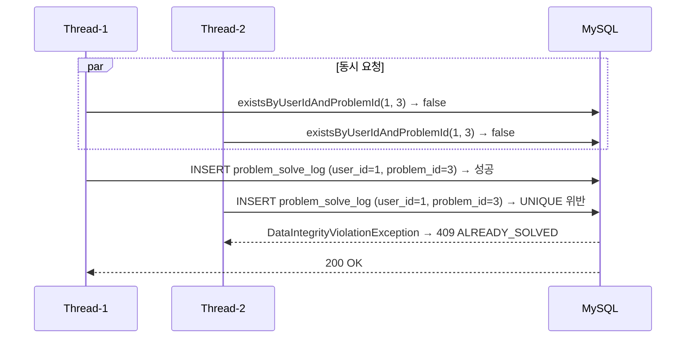

# 성능 설계

인덱스 전략, 동시성 처리, 벤치마크 결과를 정리한다.

---

## 목차

1. [인덱스 전략](#1-인덱스-전략)
2. [동시성 — 중복 제출 방지](#2-동시성--중복-제출-방지)
3. [벤치마크 결과](#3-벤치마크-결과)

---

## 1. 인덱스 전략

| 테이블 | 인덱스 | 용도 |
|--------|--------|------|
| `problem` | `(chapter_id)` | 단원별 문제 조회 |
| `problem_solve_log` | `(user_id)` | 사용자별 풀이 이력 조회 |
| `problem_solve_log` | `(problem_id)` | 문제별 풀이 통계 집계 |
| `problem_solve_log` | `UNIQUE (user_id, problem_id)` | 중복 제출 방지 + 사용자-문제 조합 조회 |
| `problem_solve_log` | `(problem_id, answer_status)` | 정답률 집계 쿼리 최적화 (커버링 인덱스) |
| `user_problem_skip` | `UNIQUE (user_id, chapter_id)` | 건너뛰기 upsert |

---

## 2. 동시성 — 중복 제출 방지

`POST /api/v1/problems/submit`은 따닥(빠른 연속 클릭)과 동시 요청을 모두 처리한다.

**2중 방어 구조**

| 계층 | 상황 | 처리 방식 | 응답 |
|------|------|-----------|------|
| Application | 순차 중복 요청 | `existsByUserIdAndProblemId` 사전 체크 | `409 ALREADY_SOLVED` |
| Database | 동시 요청 (레이스 컨디션) | `UNIQUE (user_id, problem_id)` 제약 위반 → `DataIntegrityViolationException` 핸들링 | `409 ALREADY_SOLVED` |

서비스 레이어의 사전 체크로 대부분의 중복을 걸러내고, 레이스 컨디션으로 빠져나간 요청은 DB 제약 조건이 최종 방어한다.

**레이스 컨디션 시나리오**

서비스 레이어 체크 사이에 두 스레드가 모두 `false`를 읽을 수 있다. 이 구간을 막으려면 분산 락이 필요하지만, DB UNIQUE 제약이 어차피 최종 보장을 하므로 Redis 락 없이도 정합성이 유지된다.

---

## 3. 벤치마크 결과

### 3-1. 인덱스 적용 전후 비교

`idx_solve_log_problem_status (problem_id, answer_status)` 추가 전후를 k6 부하 테스트로 측정했다.

**테스트 조건:** VU 50, 70초

| 지표 | 인덱스 전 | 인덱스 후 | 개선율 |
|------|-----------|-----------|--------|
| avg | 23.2 ms | 17.1 ms | **−26%** |
| p90 | 46.2 ms | 33.3 ms | **−28%** |
| p95 | 70.6 ms | 60.0 ms | **−15%** |
| RPS | 253 | 267 | **+5%** |

커버링 인덱스(index-only scan)로 전환되어, 데이터 행을 fetch하지 않고 인덱스만으로 COUNT를 계산한다.

> 재현 방법: `benchmark.sh` 실행

### 3-2. Redis correctRate 캐싱 비교

DB 직접 조회(`no-cache` 프로파일)와 Redis 캐시 warm 상태를 비교했다.

**테스트 조건:** VU 50, 70초, `solve_log` 594,000건

| 지표 | DB only | Redis 캐시 | 차이 |
|------|---------|------------|------|
| avg | 16.44 ms | 18.22 ms | **+1.8 ms** |
| p90 | 23.82 ms | 25.91 ms | **+2.1 ms** |
| p95 | 26.66 ms | 28.09 ms | **+1.4 ms** |
| RPS | 267.7 | 263.6 | **−1.5%** |

**결론:** 커버링 인덱스로 이미 충분한 성능이 확보된 상태에서, Redis 왕복 레이턴시가 캐시 절약 효과를 상쇄했다. DB가 원격 서버에 위치하거나 인덱스 없이 풀 스캔이 발생하는 환경에서는 Redis 캐싱이 유효할 수 있다.